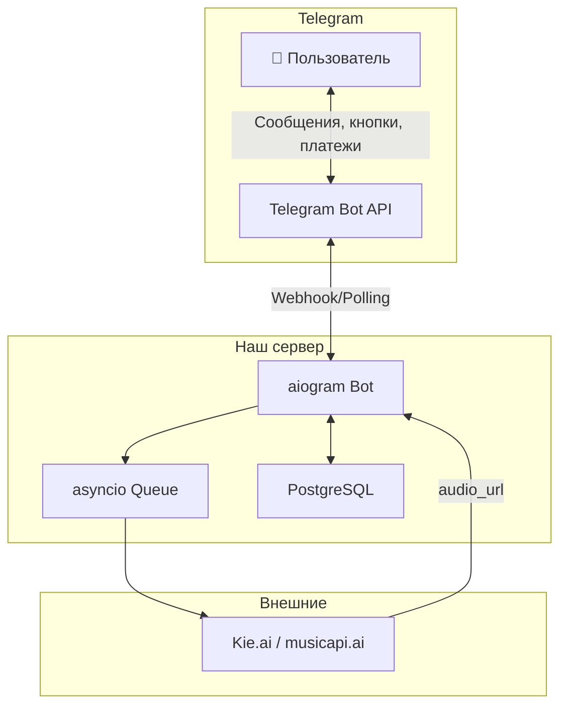
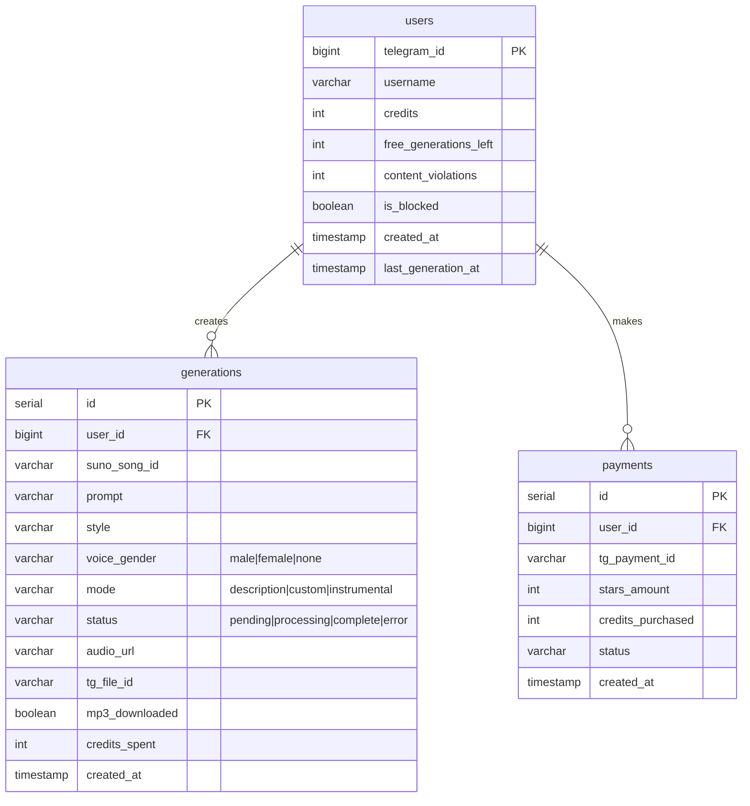
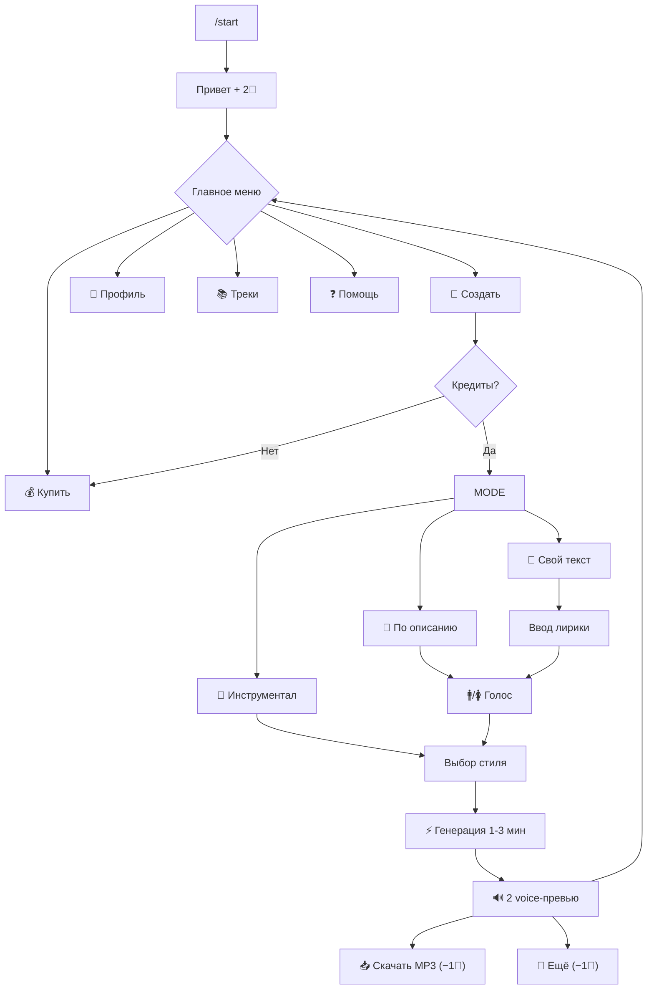

# AI Melody Bot — Финальный план

## Принятые решения

| Аспект | Решение |
|---|---|
| API доступ | Third-party API (Kie.ai / musicapi.ai) |
| Стек | Python + aiogram 3.x |
| БД | PostgreSQL |
| Хранение аудио | TG native (voice preview → audio download) |
| Защита контента | Voice message = бесплатное прослушивание. MP3 скачивание = доп. кредит |
| Язык | Только RU |
| Интерфейс | Inline-кнопки (без Web App) |
| Бесплатные кредиты | 2 при регистрации |
| Мин. пакет | 50 ⭐ = 5 кредитов |
| Списание кредитов | Только за успешные генерации |
| Content policy | Уведомление + временный бан после 3 отказов |
| Retry | Автоматический, кредит не списывается при ошибке |
| Rate limiting | Глобальный лимит/час + лимит/пользователь/день |
| Секреты | .env |
| Мониторинг | Uptime, время генерации, ошибки, кредиты |

---

## MVP-фичи

- ✅ Генерация по описанию (text prompt)
- ✅ Custom Mode (свой текст/лирика)
- ✅ Инструментальный режим
- ✅ Выбор стиля/жанра во всех режимах
- ✅ Выбор голоса: мужской / женский (во всех вокальных режимах)
- ✅ Оплата Telegram Stars
- ✅ История треков
- ✅ Контент-защита (voice preview + MP3 за кредит)
- ✅ Антифрод (user_id + cooldown + rate limit + account age)

---

## Защита контента

| Этап | Что получает пользователь | Стоимость |
|---|---|---|
| Генерация | 2 варианта как voice message (нельзя легко переслать) | 1 кредит |
| Скачивание MP3 | Полный файл аудио (audio message) | +1 кредит за трек |

---

## Антифрод (MVP)

- Telegram User ID — уникальный идентификатор
- Cooldown между бесплатными генерациями
- Rate limit: max N генераций/день на пользователя
- Account age: бесплатные кредиты только если аккаунт в боте > 24ч

---

## Архитектура



### Схема БД



---

## UX-флоу



### Кнопки

**Главное меню:**
```
[🎵 Создать трек]   [📚 Мои треки]
[💰 Кредиты: N💎]   [👤 Профиль]
         [❓ Помощь]
```

**Режим:**
```
[📝 По описанию]
[🎤 Свой текст]
[🎹 Инструментал]
[⬅️ Назад]
```

**Голос (только для вокальных режимов):**
```
[🚹 Мужской]  [🚺 Женский]
[⬅️ Назад]
```

**Стили:**
```
[🎸 Рок]       [🎹 Поп]     [🎷 Джаз]
[🎻 Классика]  [🎵 R&B]     [🔊 Электро]
[🎶 Хип-хоп]   [🌍 World]   [✏️ Свой]
[⬅️ Назад]
```

**Результат:**
```
[🔊 Вариант 1]  [🔊 Вариант 2]
[📥 Скачать #1 (−1💎)]  [📥 Скачать #2 (−1💎)]
[🔄 Ещё варианты (−1💎)]
[🏠 Меню]
```

**Покупка:**
```
[5💎 — ⭐50]
[15💎 — ⭐130]
[50💎 — ⭐400]
[100💎 — ⭐750]
```

---

## Экономика

### Себестоимость
- Генерация (Kie.ai): **~$0.06**
- Скачивание MP3: **$0** (уже сгенерировано)

### Цены

| Пакет | ⭐ | Доход ($) | Кредитов | Маржа (генерация) |
|---|---|---|---|---|
| Стартовый | 50 | $0.65 | 5 | ~54% |
| Средний | 130 | $1.69 | 15 | ~47% |
| Большой | 400 | $5.20 | 50 | ~42% |
| Максимум | 750 | $9.75 | 100 | ~38% |

> [!NOTE]
> Скачивание MP3 = чистая прибыль (контент уже сгенерирован). Это повышает реальную маржу.

### Disclaimer
*"Музыка сгенерирована ИИ. Коммерческое использование ограничено условиями Suno AI."*
